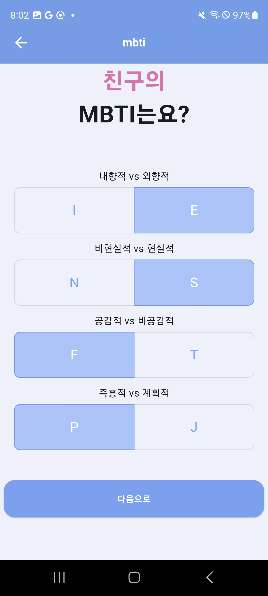

# 📌 Capstone

## 👨‍👩‍👧‍👦 팀

|이름 | [권기범](https://github.com/KibeomGwon)| [성준영](https://github.com/sungjungyoung) | [추동우](https://github.com/DongWooChoo) | [이상현](https://github.com/idealHyun) |
| :-: | :-: | :-: | :-: | :-: |
|프로필 |  |  |  |  |
| 기술 스택 |   |  |   |   |
|분류 | Back-end | Front-end | Back-end | Front-end |
|역할 | Chat, Friend, FCM | Auth, Matching, Profile, SC | Chat, Friend, FCM, Admin | Auth, Matching, Profile, SC, Nginx, Git action |

## 🏠 시스템 아키텍쳐

사진넣어야됨

## 📚 기술 스택

### 🖥️ Front-end

    

### 🗄️ Back-end

    

### 💾 Database

    

### 🚀 Deployment

    

# 📋 서비스

## 유저 페이지

### 로그인 및 회원가입
|로그인|이메일 인증|비밀번호 설정|MBTI 선택|
| :-: | :-: | :-: | :-: |
|||||

|친구 MBTI 선택|친구 키워드 선택|친구 나이 설정|프로필 이미지 선택|
| :-: | :-: | :-: | :-: |
|||||

### 매칭 페이지
|매칭|매칭 분석|요청 성공|이상형 설정|
| :-: | :-: | :-: | :-: |
|||||

|친구 키워드 설정|재매창|||
| :-: | :-: | :-: | :-: |
|||||

### 친구 페이지
|친구 리스트|친구 프로필필|받은 요청 1|받은 요청 2|
| :-: | :-: | :-: | :-: |
|||||

|보낸 요청|친구 차단|친구 관리||
| :-: | :-: | :-: | :-: |
|||||

### 채팅 페이지
|채팅창 리스트|채팅창|이벤트|이벤트 전송|
| :-: | :-: | :-: | :-: |
|||||

|이벤트 선택 후|친구 요청 중|요청 승인 보류|퇴장 기능|
| :-: | :-: | :-: | :-: |
|||||

### 마이 페이지
|메인|프로필사진 수정|정보 수정|고객센터|
| :-: | :-: | :-: | :-: |
|||||

## 관리자 페이지
|로그인|고객센터|
| :-: | :-: |
|||

|상세페이지|회원관리|
| :-: | :-: |
|
